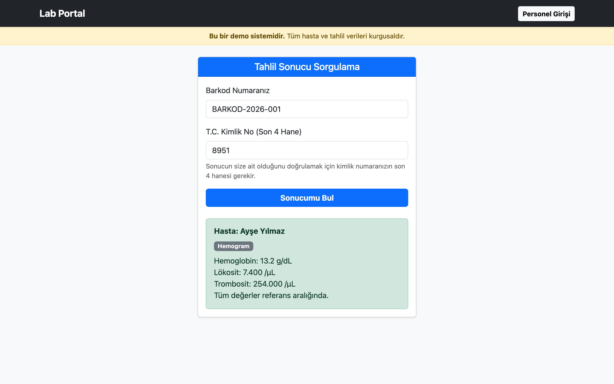
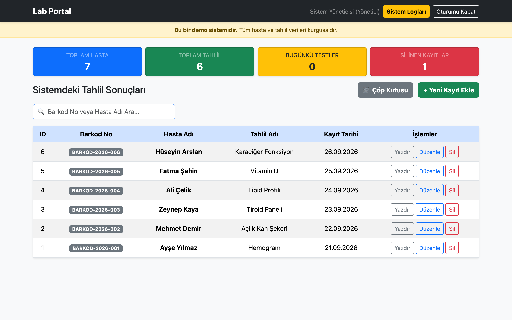
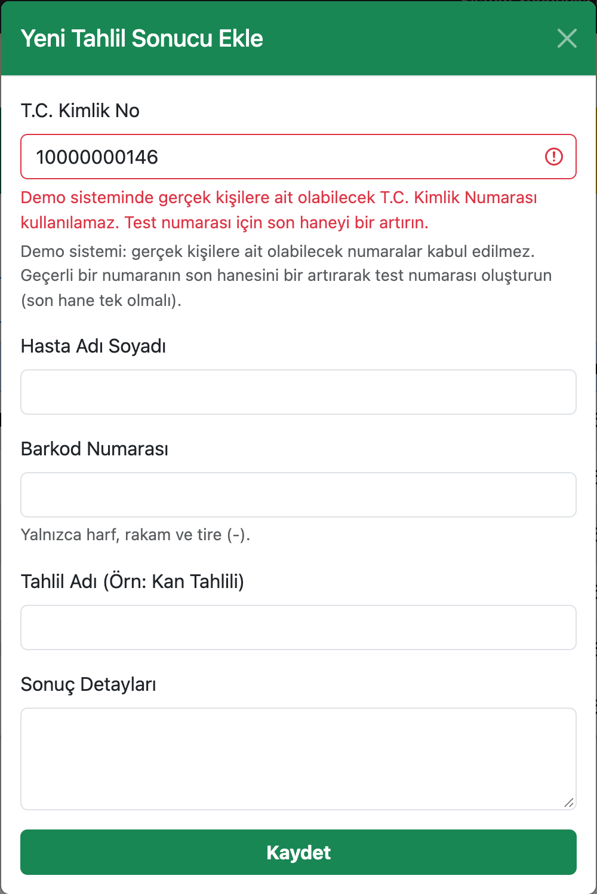
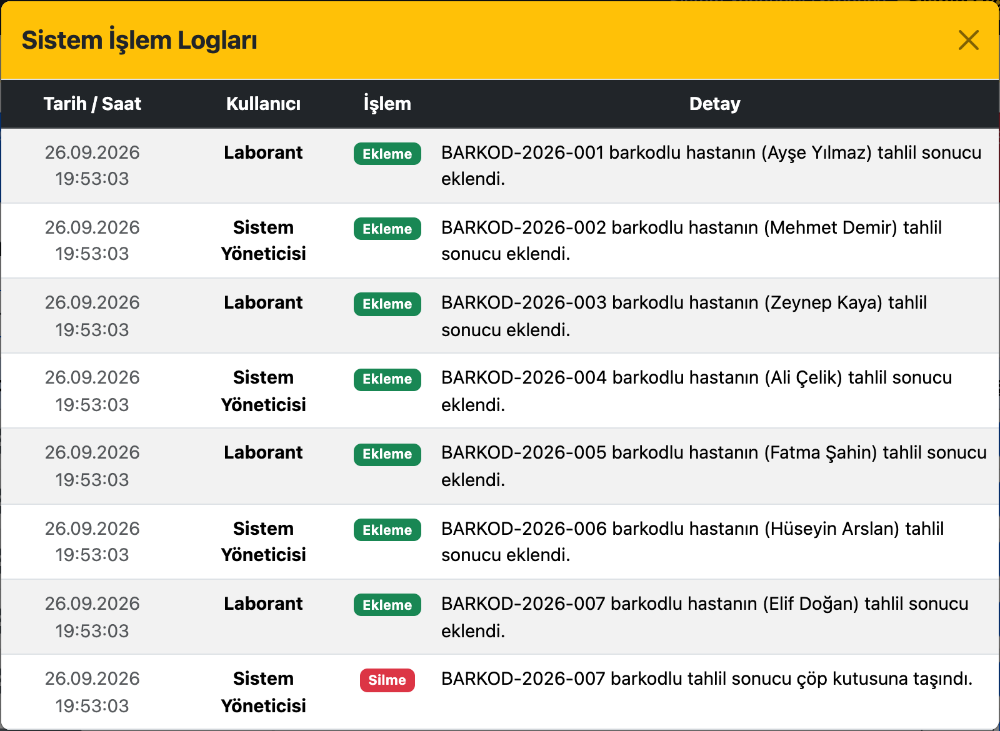
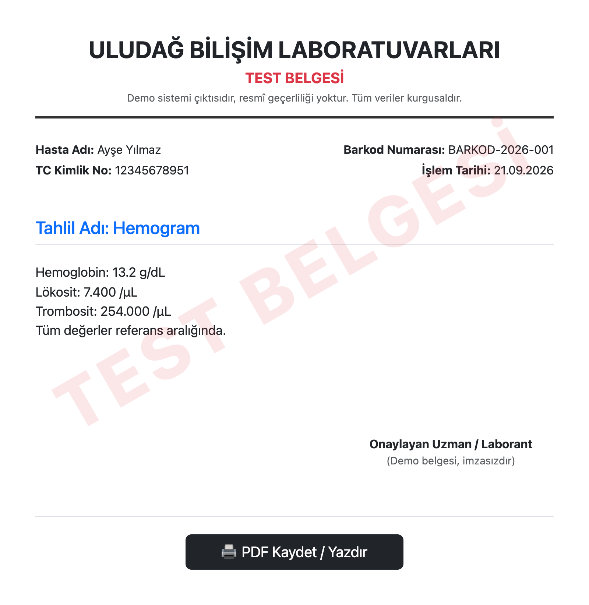

# Lab Portal

Laboratuvar tahlil sonuçlarının kaydedildiği ve hastaların kendi sonuçlarını
sorgulayabildiği tek sayfalık web uygulaması. Laravel 12 ve PostgreSQL ile
geliştirilmiştir.

Sağlık verisi KVKK kapsamında özel nitelikli kişisel veri olduğu için proje,
veri güvenliği öncelikli tasarlanmıştır. Ayrıntılar
[Güvenlik ve KVKK](#güvenlik-ve-kvkk) bölümündedir.

> **Canlı demo:** https://lab-portal-tau.vercel.app
> Demo sistemindeki tüm hasta ve tahlil verileri kurgusaldır.
> Örnek sorgu: barkod `BARKOD-2026-001`, T.C. son 4 hane `8951`.

## Özellikler

- **Hasta sorgulama** — Hasta, barkod numarası ve T.C. Kimlik Numarasının son
  4 hanesiyle yalnızca kendi sonucuna ulaşır.
- **Laborant paneli** — Tahlil sonucu ekleme, düzenleme, arama ve sayfalama.
- **Yönetici yetkileri** — Kayıt silme, çöp kutusu ve sistem işlem logları
  yalnızca `admin` rolündeki kullanıcılara açıktır.
- **Çöp kutusu** — Silinen kayıtlar kalıcı olarak kaybolmaz, geri yüklenebilir.
- **Resmî belge çıktısı** — Tahlil sonucu yazdırılabilir/PDF olarak kaydedilebilir.
- **İşlem logları** — Ekleme, güncelleme, silme ve geri yükleme işlemleri
  kullanıcı bilgisiyle birlikte kaydedilir.

Sorgulama ekranı, personel girişi ve yönetim paneli tek bir sayfada
(`/`) toplanmıştır; bölümler arası geçişte sayfa yenilenmez.

## Ekran Görüntüleri

**Hasta sorgulama** — Barkod ve T.C. Kimlik Numarasının son 4 hanesiyle
sonuç sorgulanır. Üstteki şerit, demo sistemindeki verilerin kurgusal
olduğunu belirtir.



**Yönetim paneli** — İstatistikler, arama, sayfalama ve kayıt işlemleri.
Silme, çöp kutusu ve sistem logları yalnızca yönetici rolünde görünür.



<table>
  <tr>
    <td width="50%" valign="top">
      <b>Demo modunda T.C. doğrulaması</b><br>
      Gerçek bir kişiye ait olabilecek numara reddedilir; yalnızca son hanesi
      tek olan test numaraları kabul edilir.<br><br>
      
    </td>
    <td width="50%" valign="top">
      <b>Sistem işlem logları</b><br>
      Ekleme, güncelleme, silme ve geri yükleme işlemleri, işlemi yapan
      kullanıcıyla birlikte kaydedilir.<br><br>
      
    </td>
  </tr>
</table>

**Test belgesi** — Demo sisteminden alınan çıktılar başlıkta ve filigranla
"TEST BELGESİ" olarak işaretlenir, "elektronik imzalıdır" ibaresi kaldırılır.



## Güvenlik ve KVKK

### Demo modu: gerçek kişilere ait veri işlenmez

Herkese açık demo kurulumu `DEMO_MODE=true` ile çalışır. Bu modda:

- **Gerçek olabilecek T.C. Kimlik Numaraları sisteme girilemez.** Geçerli bir
  T.C. Kimlik Numarasının son hanesi, doğrulama algoritması gereği **her zaman
  çifttir**. Demo modunda yalnızca algoritmanın ilk 10 hane kurallarını
  sağlayan ama son hanesi doğru değerin bir fazlası (yani **tek**) olan test
  numaraları kabul edilir. Bu numaraların hiçbiri matematiksel olarak gerçek
  bir kişiye ait olamaz. Gerçek olabilecek bir numara girilirse kayıt
  reddedilir. Kural sunucuda ve tarayıcıda aynı şekilde uygulanır.
- **Tüm demo verileri kurgusaldır.** Hasta adları, barkodlar ve tahlil
  sonuçları uydurmadır; arayüzün üstünde bunu belirten kalıcı bir uyarı şeridi
  bulunur.
- **Yazdırılan belgeler "TEST BELGESİ" olarak işaretlenir.** Başlıkta ve her
  sayfada çapraz filigranla belirtilir, "elektronik imzalıdır" ibaresi
  kaldırılır; demo çıktısı resmî bir belge sanılamaz.

Gerçek bir kurumda kullanılacaksa `DEMO_MODE` kapatılır; doğrulama gerçek
T.C. Kimlik Numaralarını kabul eden standart kurala döner.

> **Not:** Gerçek hasta verisiyle çalışacak bir kurulumda KVKK'nın özel
> nitelikli veri ve yurt dışına aktarım hükümleri ayrıca değerlendirilmelidir.
> Demo, verinin yurt dışındaki bulut sağlayıcılarda (Vercel, Neon) tutulduğu
> bir mimariyle yayındadır; bu yüzden yalnızca kurgusal veriyle çalışır.

### Erişim kayıtları

Özel nitelikli verilere erişim kayıt altına alınır ve yalnızca yönetici
tarafından "Erişim Logları" ekranında görüntülenebilir:

| Olay | Kaydedilen |
|---|---|
| Hasta sorgusu | Sonuç (başarılı / başarısız / kilitli), sorgulanan barkod, IP, tarayıcı bilgisi, zaman |
| Personel girişi | Sonuç, hesap (deneme gerçek bir hesaba yapıldıysa), IP, zaman |
| Kayıt görüntüleme | Tam T.C. Kimlik Numarasını gören personel, kaydın barkodu, IP, zaman |

KVKK'nın veri minimizasyonu ilkesi gereği **T.C. Kimlik Numarası ve son 4
hanesi hiçbir koşulda kaydedilmez.** Başarısız girişlerde yazılan e-posta
adresi de saklanmaz. Kayıtlar **1 yıl** sonra otomatik olarak silinir
(`php artisan model:prune` ile elle de temizlenebilir). Sorgu ekranında
ziyaretçi, hangi bilgilerinin ne süreyle tutulduğu konusunda bilgilendirilir.

### Uygulama güvenliği


- **T.C. Kimlik Numarası doğrulaması** — Hem sunucuda
  (`app/Rules/TurkishIdentityNumber.php`) hem tarayıcıda aynı algoritma çalışır:
  11 hane, yalnızca rakam, ilk hane sıfır olamaz ve iki basamak doğrulama
  kuralı sağlanmalıdır. Bu kuralın doğal sonucu olarak geçerli bir numara
  daima çift rakamla biter.
- **Kimlik numarası sızdırılmaz** — `Patient` modelinde varsayılan olarak
  gizlidir; yalnızca yetkili belge uç noktasında görünür kılınır. Herkese açık
  sorgulama yanıtında hiçbir koşulda yer almaz.
- **İstek sınırlama** — Giriş ve hasta sorgulama uç noktalarında IP başına
  dakikalık istek limiti vardır. Vercel'de istekler bir aracı üzerinden
  geldiği için ziyaretçinin gerçek IP'si Vercel'in yazdığı `X-Forwarded-For`
  başlığından okunur; aksi halde tüm ziyaretçiler aynı sayacı paylaşırdı.
  Hasta sorgusu ve personel girişinin sayaçları ayrıdır; hatalı sorgular
  personelin girişini engellemez.
- **Barkod başına kilit** — Aynı barkoda 1 saat içinde 5 hatalı sorgudan sonra
  o barkod kilitlenir; çok sayıda IP kullanan bir saldırgan da durdurulur.
  Kilit var olmayan barkodlar için de aynı şekilde işler, böylece kilit mesajı
  bir barkodun var olup olmadığını ele vermez.
- **Tahmin edilemeyen barkodlar** — Yeni kayıtların barkodu kullanıcıdan
  alınmaz; kriptografik olarak güvenli rastgelelikle üretilir
  (`LP-` + 8 karakter, yaklaşık 10¹² ihtimal).
- **Token tabanlı kimlik doğrulama** — Laravel Sanctum. Token'lar 8 saat sonra
  geçersiz olur; çıkış yapıldığında sunucu tarafında da iptal edilir.
- **Varsayılan şifre yok** — Başlangıç kullanıcılarının şifreleri yalnızca
  ortam değişkenlerinden okunur. Değer eksik ya da 12 karakterden kısaysa
  kurulum hata verip durur.
- **XSS koruması** — Veritabanından gelen tüm metinler arayüze basılmadan önce
  kaçışlanır; hasta adı gibi alanlar ayrıca sunucuda biçim doğrulamasından geçer.

## Kurulum

Gereksinimler: PHP 8.2+, Composer, PostgreSQL, Node.js

```bash
composer install
npm install
cp .env.example .env
php artisan key:generate
```

`.env` dosyasındaki veritabanı bilgilerini ve `SEED_*` şifrelerini (en az 12
karakter) doldurun,
ardından:

```bash
php artisan migrate --seed
php artisan serve
```

Uygulama `http://localhost:8000` adresinde çalışır.

## Testler

```bash
./vendor/bin/pest
```

Testler kimlik numarası doğrulama algoritmasını, yetkilendirme kurallarını ve
herkese açık sorgulama uç noktasının veri sızdırmadığını kapsar.

## Dağıtım (Vercel)

Uygulama Vercel'in ücretsiz Hobby planında, topluluk PHP runtime'ı ile çalışır.
Gerekli dosyalar depoda hazırdır: `vercel.json`, `api/index.php`, `.vercelignore`.

Vercel sunucusuz (serverless) çalıştığı için iki kısıt vardır:

1. **Dosya sistemi salt-okunurdur.** `api/index.php`, Laravel'in önbellek, log
   ve derlenmiş görünüm dizinlerini `/tmp` altına yönlendirir. `/tmp` kalıcı
   değildir, bu yüzden veritabanı mutlaka harici olmalıdır (SQLite kullanılamaz).
2. **Her istek ayrı bir örnekte çalışabilir.** Oturum ve önbellek `file`
   sürücüsüyle çalışmaz. Özellikle giriş denemesi sınırlaması önbelleğe
   dayandığı için `CACHE_STORE=database` olmalıdır; `array` seçilirse sınırlama
   her istekte sıfırlanır ve işlevsiz kalır.

### Adımlar

1. Ücretsiz bir PostgreSQL veritabanı oluşturun (ör. Neon). Bağlantı bilgilerini alın.
2. Depoyu GitHub'a gönderin ve Vercel'de "Import Project" ile bağlayın.
3. Vercel proje ayarlarında aşağıdaki ortam değişkenlerini tanımlayın.
4. Veritabanı tablolarını yerelden oluşturun (Vercel build sırasında migration
   çalıştırılmaz — birden fazla örnek aynı anda başlayabilir):

```bash
php artisan migrate --force
php artisan db:seed --force
```

### Vercel ortam değişkenleri

| Değişken | Değer |
|---|---|
| `APP_KEY` | `php artisan key:generate --show` çıktısı |
| `APP_ENV` | `production` |
| `APP_DEBUG` | `false` |
| `APP_URL` | Vercel'in verdiği adres |
| `DB_CONNECTION` | `pgsql` |
| `DB_HOST` / `DB_PORT` / `DB_DATABASE` / `DB_USERNAME` / `DB_PASSWORD` | Veritabanı sağlayıcısından |
| `CACHE_STORE` | `database` |
| `SESSION_DRIVER` | `cookie` |
| `QUEUE_CONNECTION` | `sync` |
| `LOG_CHANNEL` | `stderr` |
| `DEMO_MODE` | `true` (herkese açık demo için) |
| `SEED_ADMIN_EMAIL` / `SEED_ADMIN_PASSWORD` | Yönetici hesabı |
| `SEED_LAB_EMAIL` / `SEED_LAB_PASSWORD` | Laborant hesabı |

`APP_DEBUG` değerinin `false` kaldığından emin olun; aksi halde hata sayfaları
veritabanı bilgilerini açığa çıkarır.

## Proje Yapısı

```
app/Http/Controllers/Api/   API denetleyicileri (kimlik doğrulama, tahlil sonuçları)
app/Http/Middleware/        Yönetici yetki kontrolü
app/Models/                 Patient, TestResult, SystemLog, User
app/Rules/                  T.C. Kimlik Numarası doğrulama kuralı
resources/views/portal.blade.php   Tek sayfalık arayüz
resources/views/print.blade.php    Yazdırılabilir sonuç belgesi
routes/api.php              API rotaları
routes/web.php              Sayfa rotaları
tests/                      Pest testleri
```
